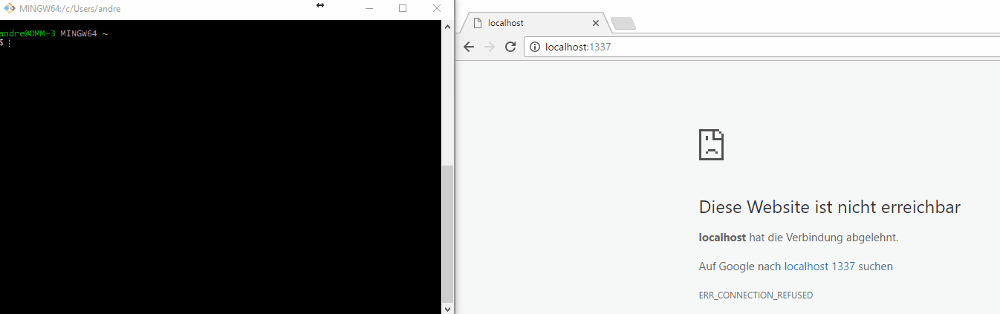

# Generator-NExT 
[![NPM version][npm-image]][npm-url] [![Coverage Status][coveralls-image]][coveralls-url] [![Build Status][travis-image]][travis-url]
> Generator that provides a basic setup for a **N**ode project with **Ex**press and **T**ypescript.



## Installation

First, install [Yeoman](http://yeoman.io) and Generator-NExT using [npm](https://www.npmjs.com/) (we assume you have pre-installed [node.js](https://nodejs.org/)).

```bash
npm install -g yo
npm install -g generator-next
```

Then generate your new project:

```bash
yo next <project-name>
```

All files will be created inside the directory ```./<project-name>``` (relative to your current position).


Feel free to [learn more about Yeoman](http://yeoman.io/).

## Documentation

### Used frameworks, libraries and tools:
 
#### Language:
 - [Typescript](https://github.com/Microsoft/TypeScript)
 
#### Runtime:
 - [Node](https://github.com/nodejs/node)
 - [Nodemon](https://github.com/remy/nodemon)

#### Build:
 - [Gulp](https://github.com/gulpjs/gulp)
 - ... check the gulpfile.js in generators/app/templates for all used plugins
 
#### Web Framework:
 - [Express](https://github.com/expressjs/express)

#### Logging:
 - [Morgan](https://github.com/expressjs/morgan)
 - [Winston](https://github.com/winstonjs/winston)

#### Test:
 - [Istanbul](https://github.com/gotwarlost/istanbul)
 - [Remap-istanbul](https://github.com/SitePen/remap-istanbul)
 - [Mocha](https://github.com/mochajs/mocha)
 
#### Others:
 - [Tslint](https://github.com/palantir/tslint)  
 - [Typedoc](https://github.com/TypeStrong/typedoc)  

## Changelog / Releases

Check here for available [releases](https://github.com/ommsolutions/generator-next/releases).

**Release strategy**  
For versions 0.x.x, additional features and best practices will be added to the extended sub-generator.
```bash
yo next:extended <project-name>
```
However, they will all be included in the resulting schaffolding, so you have to delete the stuff you don't 
want to keep manually.  
In releases >1.x.x, all features will be selectable during the setup process and cross-compatibility will be ensured 
for all combinations.

## Roadmap


 Version 0.5.x:   Implement sub generator which adds [rxjs](https://github.com/Reactive-Extensions/RxJS)  
 Version 0.6.x:   Implement sub generator which adds [mongoose](https://github.com/Automattic/mongoose)  
 Version 0.7.x:   Implement sub generator which adds [pug](https://github.com/pugjs/pug)  
 Version 1.x.x:   Combine all sub generators combined depending on the user's responses.
 
 In discussion:
  - Add build task to generate windows executable  
  - Add generator (option) which creates systemd init scripts to run server as service on *nix distributions
 
## License

MIT

[npm-image]: https://badge.fury.io/js/generator-next.svg
[npm-url]: https://npmjs.org/package/generator-next
[coveralls-image]:https://coveralls.io/repos/github/ommsolutions/generator-next/badge.svg?branch=master
[coveralls-url]: https://coveralls.io/github/ommsolutions/generator-next?branch=master
[travis-image]:https://travis-ci.org/ommsolutions/generator-next.svg?branch=master
[travis-url]:https://travis-ci.org/ommsolutions/generator-next?branch=master
